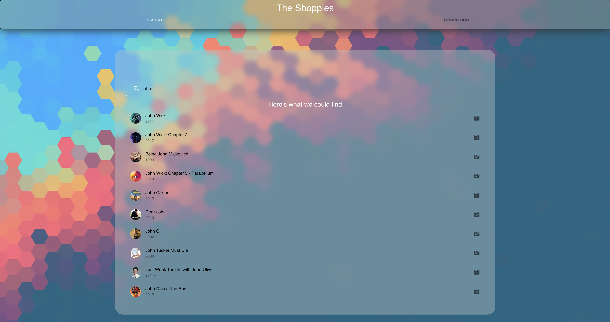
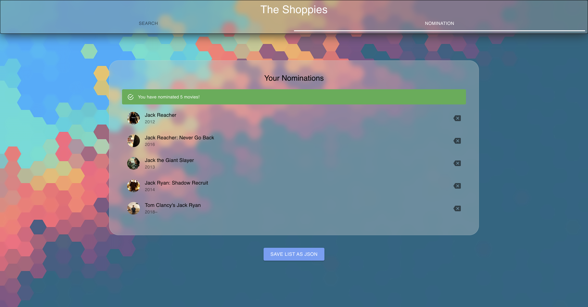

# The Shoppies

The Shoppies is a web app that provides help to search movies via OMDB database and add to personal nomination list which can be export as a JSON file.




## Installation

To ensure a proper installation please verify that your system has npm, react-app installed correctly. For more instructions on this please refer to: https://reactjs.org/.

<h3>Locally:</h3>
If running locally you will also need to do the following:

git clone https://github.com/anthony-y-zhu14/The-Shoppies

```bash
cd /The-Shoppies/
npm install
```

Once you have completed the above steps you will have to run:

```bash
cd /The-Shoppies/app
npm start
```

navigate to http://127.0.0.1:3000/

Happy movie hunting :-)

## Usage

Use for searching and nominating movies only.


## Libraries & Frameworks Used
- Material UI (https://material-ui.com/)
- ReactJs

## Contributing
Contributor:

```bash
Anthony Y. Zhu
```

Pull requests are welcome. For major changes, please open an issue first to discuss what you would like to change.

Please make sure to update tests as appropriate.

